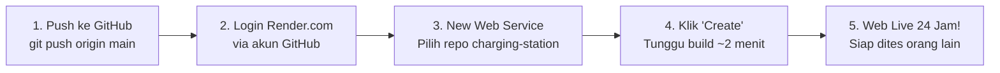

# 🚀 Panduan Lengkap Deploy Cloud 24 Jam Nonstop (Render.com)

Panduan ini memandu Anda mempublikasikan aplikasi **VOLTX EV Charging Station Simulator** ke internet secara **100% GRATIS** menggunakan **Render.com**.

Setelah dideploy:
- 🌐 Web dapat diakses dari mana saja di seluruh dunia via HTTPS aman.
- ⚡ **Laptop Anda HIDUP atau MATI tidak berpengaruh** — server tetap aktif di cloud data center.
- 📱 Orang lain (dosen, penguji, teman) cukup membuka link atau scan QR Code langsung dari HP mereka.
- 🔄 Sinkronisasi realtime (WebSockets) antara Kios dan Driver tetap berjalan sempurna.

---

## 📋 Ringkasan Spesifikasi Hosting

| Parameter | Nilai |
| :--- | :--- |
| **Provider** | [Render.com](https://render.com/) |
| **Paket** | **Free Web Service ($0 / Gratis)** |
| **Region** | **Singapore (Southeast Asia)** — Paling cepat dan rendah latensi untuk Indonesia |
| **Runtime** | Python 3.11 |
| **WebSockets** | Didukung penuh secara native (`wss://`) |
| **Domain** | Disediakan gratis: `https://[nama-aplikasi-anda].onrender.com` |

---

## 🛠️ Langkah-Langkah Deployment (5 Menit Selesai)



---

### Langkah 1: Push Perubahan Terbaru ke GitHub

Buka terminal di folder project Anda (PowerShell / Command Prompt), lalu jalankan perintah:

```powershell
git add .
git commit -m "feat: config cloud-ready deployment for Render 24/7"
git push origin main
```

Pastikan commit berhasil ter-push ke repositori GitHub Anda:
`https://github.com/soul222/charging-station`

---

### Langkah 2: Buat Akun / Login di Render.com

1. Buka browser dan kunjungi: **[https://render.com/](https://render.com/)**
2. Klik tombol **"GET STARTED FOR FREE"** atau **"Sign In"**.
3. **PILIH "Sign in with GitHub"** (Gunakan akun GitHub yang menyimpan repo `charging-station`).

---

### Langkah 3: Buat Web Service Baru

1. Di Dashboard Render, klik tombol **"New +"** (di pojok kanan atas) lalu pilih **"Web Service"**.
2. Pilih opsi **"Build and deploy from a Git repository"** lalu klik **Next**.
3. Di daftar repository, cari dan klik **"Connect"** pada repository:
   **`soul222/charging-station`**
   *(Jika belum muncul, klik "Configure account" untuk memberi izin Render membaca repository Anda)*.

---

### Langkah 4: Isi Formulir Konfigurasi

Isi pengaturan berikut (sebagian besar sudah otomatis terdeteksi):

| Kolom Input | Isi dengan Nilai Berikut |
| :--- | :--- |
| **Name** | `voltx-charging-station` *(atau nama unik pilihan Anda)* |
| **Region** | **Singapore (Southeast Asia)** *(sangat disarankan)* |
| **Branch** | `main` |
| **Root Directory** | *(Biarkan kosong)* |
| **Runtime** | `Python 3` |
| **Build Command** | `pip install -r requirements.txt` |
| **Start Command** | `uvicorn app.main:app --host 0.0.0.0 --port $PORT` |
| **Instance Type** | Pilih **Free ($0/month)** |

#### (Opsional) Menambahkan Environment Variable:
Gulir ke bawah ke bagian **Environment Variables**, klik **"Add Environment Variable"**:
- Key: `CLOUD_MODE`
- Value: `true`

---

### Langkah 5: Klik "Create Web Service" & Tunggu Build

1. Klik tombol **"Create Web Service"** di bagian paling bawah.
2. Render akan otomatis memulai proses build:
   - Mengunduh repository GitHub Anda.
   - Menginstal library dari `requirements.txt`.
   - Menjalankan server FastAPI.
3. Tunggu sekitar **1–2 menit** hingga status di dashboard berubah menjadi **`Live`** (berwarna hijau).

---

### Langkah 6: Web Siap Digunakan & Dites Orang Lain! 🎉

Di bagian atas dashboard Render, Anda akan melihat URL publik Anda, contohnya:
👉 **`https://voltx-charging-station.onrender.com`**

#### Cara Menguji Bersama Orang Lain:
1. **Layar Kios (Station Screen)**:
   Buka di laptop, monitor, atau tablet Anda:
   **`https://[nama-app].onrender.com/kiosk`**
   *(Layar Kios akan menampilkan QR Code dinamis otomatis)*.

2. **Aplikasi Driver (Smartphone Orang Lain)**:
   Kirimkan link ini ke teman/dosen Anda, atau minta mereka scan QR di layar Kios:
   **`https://[nama-app].onrender.com/driver`**

3. **Lakukan Simulasi Pengisian Daya**:
   - Orang lain mendaftar / login akun di HP mereka.
   - Pilih nozzle (AC / DC / CCS).
   - Klik tombol **"⚡ Colok Simulasi"**.
   - Bayar deposit (Saldo / QRIS / E-Money).
   - Aliran daya dan persentase baterai bergerak secara sinkron di kedua layar via WebSocket!
   - Tekan "Stop Charging", biaya riil dihitung, dan sisa saldo otomatis di-refund.

---

## 💡 Catatan Penting Mengenai Free Tier Render (Tips Presentasi)

> [!NOTE]
> **Mekanisme Spin-Down (Sleep Mode):**
> - Pada paket gratis Render, jika web sama sekali tidak diakses selama **15 menit**, server akan masuk ke mode *sleep* untuk menghemat daya server.
> - Saat ada orang yang membuka web tersebut kembali, server butuh sekitar **40–50 detik** untuk "bangun" (*spin up*).
> - **Tips Saat Mau Demo / Dinilai Dosen:**
>   Buka link web Anda sekitar 1–2 menit sebelum presentasi dimulai agar server sudah dalam keadaan *bangun* dan langsung responsif ketika penguji membukanya!
