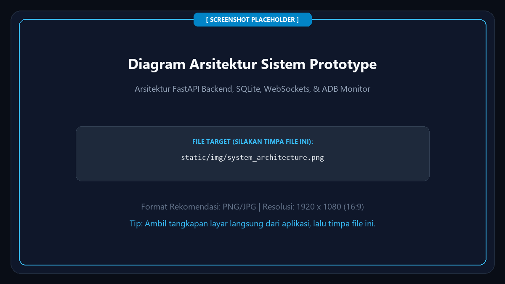

# Product Requirements Document (PRD): Simulasi EV Charging Station

> **Sistem Simulasi Stasiun Pengisian Kendaraan Listrik (EVCS)**
> Menggunakan **Laptop sebagai Mesin Station (Kios)** dan **HP (Smartphone) sebagai Aplikasi Driver / Mobil**.
> Dibangun dengan ekosistem **Python (FastAPI, WebSockets, SQLite)**.

---

## 1. Referensi Alur Asli (Whiteboard)


### Rekap Poin Papan Tulis:
- **Pricing**: Harga berdasarkan output riil (`Rp / 500 mAh`).
- **Billing System**: Sistem deposit di depan & menggunakan akun pengguna.
- **Mode Charging**:
  - **AC (Normal Charge)**: Type 2 (22.000 W).
  - **DC (Fast & Ultra-Fast Charge)**: CHAdeMO (50.000 W) & CCS2 (150.000 W).
- **Vehicle Awareness**: Charging station mengetahui kapasitas baterai setiap HP/perangkat (5.000 mAh).

---

## 2. Alur Kerja Pengguna (User Flow 1 s/d 10)

| Langkah | Aksi Pengguna (HP) | Respons Sistem & Tampilan Layar Laptop |
| :---: | :--- | :--- |
| **1** | Buka sistem di HP (`http://[IP-LAPTOP]:8000/driver`) | Server FastAPI menyajikan antarmuka mobile web modern. |
| **2** | Masuk Home Page | Menampilkan profil user, info HP, dan kartu Saldo Deposit. |
| **3** | Pilih menu *Charge HP* | Masuk ke alur inisiasi pengisian. |
| **4** | Pilih lokasi charge | Pilihan stasiun (misal: *SPKLU Sudirman Central Hub*). |
| **5** | Scan QR Station / Nozzle | Kamera HP memindai QR Code dinamis di layar Laptop. |
| **6** | Colokkan nozzle ke HP | Sambungkan kabel USB atau klik *"⚡ Colok Simulasi"*. Layar laptop berubah status menjadi **🔌 KABEL TERCOLOK**. |
| **7** | Sistem deteksi baterai | Sistem membaca SoC (%) dan total kapasitas baterai HP (mAh). |
| **8** | Pilih target pengisian | Dua opsi: **Charge Full (100%)** atau **Input mAh Manual**. |
| **9** | Pilih metode pembayaran | Pembayaran deposit awal (Saldo Akun / QRIS / Tap E-Money). Gerbang daya terkunci sampai bayar berhasil. |
| **10**| Sistem memulai charge | Aliran daya aktif! Speedometer daya Watt (W) dan penambahan mAh bergerak sinkron di HP dan Laptop. |
| **+** | **Berhenti & Auto-Refund** | Klik **"Stop Charging"** atau cabut kabel. Aliran listrik mati, nozzle kembali standby, biaya riil dihitung, dan **sisa saldo deposit otomatis di-refund seketika**! |

---

## 2.1 Detail Sistem Pembayaran (Deposit Saldo, QRIS, E-Money)

Sistem mengakomodasi 3 opsi pembayaran:

### 1. Deposit Saldo (In-App Prepaid Wallet)
- **Fungsi**: Dompet digital utama di aplikasi pengguna.
- **Top-Up**: Pengguna dapat mengisi saldo kapan saja via simulasi transfer/QRIS (pilihan Rp 50.000, Rp 100.000, Rp 200.000).
- **Alur Cas**: Saat mulai mengecas, saldo di-*HOLD* sejumlah estimasi. Saat cas selesai/berhenti di tengah jalan, sisa saldo yang tidak terpakai langsung di-*UNHOLD* seketika ke akun pengguna.

### 2. Pembayaran Langsung via QRIS Dinamis (Pay-per-Charge)
- **Fungsi**: Untuk pengguna yang ingin langsung bayar per sesi tanpa harus top-up saldo dompet terlebih dahulu.
- **Alur Cas**: Sistem memunculkan kode QRIS dengan nominal pas sesuai target mAh yang dipilih. Pengguna memindai QRIS via aplikasi bank/e-wallet. Begitu status `PAID`, charger otomatis menyala.
- **Mekanisme Refund**: Jika berhenti lebih awal, sisa dana yang belum terpakai otomatis dikembalikan ke **Saldo Akun Aplikasi** pengguna (karena transaksi QRIS perbankan tidak mendukung instan parsial refund ke rekening pengirim).

### 3. E-Money / Kartu RFID (Tap-and-Charge)
- **Fungsi**: Membuka kunci dan membayar dengan kartu fisik (Flazz, Mandiri E-Money, Brizzi, atau kartu RFID SPKLU).
- **Alur Interaksi Pembayaran**:
  1. Pengguna menentukan target/nominal pengisian di aplikasi atau kios (misal Rp 50.000).
  2. Pengguna memilih metode pembayaran: **"E-Money / Kartu Fisik"**.
  3. Sistem memunculkan prompt/dialog: *"Silakan Tap Kartu E-Money Anda pada Sensor Mesin Charger"*.
  4. Pengguna men-tap kartu pada sensor mesin (di laptop ada tombol/modal simulasi tap kartu).
  5. **Verifikasi Saldo Real-Time**:
     - **Jika Saldo Cukup**: Saldo kartu/akun berhasil dipotong/di-hold Rp 50.000, terdengar bunyi *beep* sukses, status menjadi **PAID**, dan mesin charger langsung mulai mengalirkan daya listrik.
     - **Jika Saldo Tidak Cukup**: Pembayaran **GAGAL**, muncul notifikasi merah *"Saldo E-Money Tidak Cukup (Sisa Rp 20.000, Butuh Rp 50.000)"*, mesin tetap terkunci, dan pengguna diarahkan untuk **memilih metode pembayaran lain** (seperti QRIS atau Saldo Dompet) atau menyesuaikan nominal target cas.

---

## 3. Spesifikasi Teknis Perangkat (Laptop vs HP)



---

## 4. Logika Perhitungan & Rumus Matematika

### A. Estimasi Pengisian
$$\text{Daya Dibutuhkan (mAh)} = \text{Kapasitas Baterai (5.000 mAh)} \times \frac{\text{Target SoC} - \text{Current SoC}}{100}$$
$$\text{Estimasi Biaya} = \frac{\text{Daya Dibutuhkan (mAh)}}{500} \times \text{Tarif per 500 mAh}$$
$$\text{Estimasi Durasi (Menit)} = \frac{\text{Daya Dibutuhkan (mAh)}}{\text{Kecepatan Cas (mAh/menit)}}$$

### B. Rumus Penghentian di Tengah Jalan & Auto-Refund
$$\text{Biaya Terpakai} = \frac{\text{Total mAh Riil Masuk}}{500} \times \text{Tarif per 500 mAh}$$
$$\text{Nominal Refund} = \text{Saldo Deposit Awal} - \text{Biaya Terpakai}$$

---

## 5. Struktur Direktori Proyek

```
charging-station/
├── PRD.md                       # Dokumen spesifikasi kebutuhan produk ini
├── docs/
│   └── whiteboard_flow.png      # Foto diagram alur papan tulis
├── app/
│   ├── __init__.py
│   ├── main.py                  # Server FastAPI & WebSocket
│   ├── database.py              # SQLite Database
│   ├── models.py                # Database Models (User, Station, Session, Wallet)
│   ├── schemas.py               # Pydantic Models
│   ├── services/
│   │   ├── charging_engine.py   # Simulasi aliran daya Watt (W) & kenaikan baterai (mAh)
│   │   ├── billing_service.py   # Logika deposit, kalkulasi riil, dan refund
│   │   └── station_manager.py   # Status mesin stasiun
│   └── routers/
│       ├── api_auth.py          # Autentikasi & Saldo Dompet
│       ├── api_station.py       # Data stasiun & status konektor
│       └── ws_charging.py       # Live telemetry sync via WebSocket
├── static/
│   ├── css/
│   │   └── style.css            # Desain UI EV Neon Dark Theme
│   └── js/
│       ├── kiosk.js             # Logic layar Laptop
│       └── driver.js            # Logic web app HP
├── templates/
│   ├── kiosk.html               # UI Layar Laptop (Totem SPKLU)
│   └── driver.html              # UI Layar HP (Mobile Driver)
├── requirements.txt             # Dependensi Python
└── run.py                       # Launcher server dengan cetak IP & QR link HP
```
