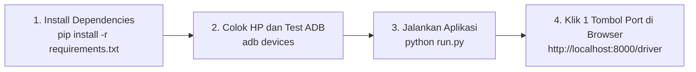

# ⚡ Panduan Setup & Konfigurasi Demo di Laptop Berbeda (Multi-Device Setup Guide)

Dokumen ini adalah panduan lengkap langkah demi langkah untuk mempersiapkan, mengkonfigurasi, dan menjalankan simulasi **VOLTX EV Charging Station (SPKLU)** pada **perangkat laptop baru yang berbeda** (misalnya saat membawa demo ke laptop kantor, kampus, pameran, juri, atau klien).

---

## ⚡ Cheat Sheet: 3 Menit Setup di Laptop Baru



---

## 📋 1. Prasyarat di Laptop Baru

Sebelum menjalankan aplikasi di komputer/laptop lain, pastikan hal-hal berikut sudah terpasang:

### 1.1. Python 3.10+ & Virtual Environment
1. Pastikan Python 3.10 ke atas sudah terinstal (centang opsi *"Add Python to PATH"* saat instalasi).
2. Buka terminal (PowerShell / Command Prompt) di folder project:
   ```powershell
   pip install -r requirements.txt
   ```

### 1.2. Android Debug Bridge (ADB)
Sistem membaca level baterai HP asli melalui perintah `adb shell dumpsys battery`.
1. Pastikan executable `adb.exe` tersedia di laptop baru.
2. Sistem otomatis mencari file `adb` pada:
   - Environment PATH sistem (`which adb`)
   - `C:\platform-tools\adb.exe`
   - `%LOCALAPPDATA%\Android\Sdk\platform-tools\adb.exe`
3. Cek di terminal:
   ```powershell
   adb version
   ```
   *(Jika belum ada, unduh [Android SDK Platform-Tools](https://developer.android.com/tools/releases/platform-tools) lalu ekstrak ke `C:\platform-tools`)*.

### 1.3. Konfigurasi HP Android
1. Aktifkan **Opsi Pengembang (Developer Options)** di HP (*Pengaturan > Tentang Ponsel > Ketuk 'Nomor Versi / Build Number' 7 kali*).
2. Masuk ke *Pengaturan > Opsi Pengembang > Aktifkan **USB Debugging***.
3. Hubungkan HP ke laptop dengan kabel data USB.
4. **PENTING:** Saat muncul pop-up di layar HP *"Izinkan USB Debugging dari komputer ini?"*, centang kotak **"Selalu izinkan dari komputer ini"** lalu klik **Izinkan (OK)**.
5. Verifikasi koneksi di terminal laptop:
   ```powershell
   adb devices
   ```
   Pastikan statusnya **`device`** (bukan `unauthorized` atau kosong):
   ```text
   List of devices attached
   RFCW21XXXXX    device
   ```

### 1.4. Jaringan Wi-Fi / Hotspot yang Sama
- Laptop (Kiosk) dan Smartphone (Driver) **harus berada dalam 1 jaringan lokal yang sama**.
- **Tips Demo Lapangan:** Aktifkan *Hotspot Pribadi / Tethering* di HP Anda, lalu sambungkan Laptop ke hotspot HP tersebut. Ini cara paling stabil saat berada di luar ruangan atau jaringan kantor yang memblokir koneksi lokal antar-perangkat.

---

## 🔍 2. Memahami Cara Kerja Penomoran Port USB

### Mengapa Port USB di Laptop Berbeda Perlu Diperhatikan?
- Pada sistem operasi Windows, motherboard memberi identitas fisik unik pada setiap lubang colokan USB melalui Registry (`LocationInformation`), misalnya `Port_#0002.Hub_#0001`, `Port_#0005`, atau `Port_#0007`.
- File konfigurasi [`usb_ports_config.json`](file:///C:/Users/soult/Downloads/charging-station/usb_ports_config.json) di root project memetakan nama port fisik tersebut ke nomor Nozzle SPKLU:
  - **Nozzle 1 (AC Type 2)** ➔ Max 22.000 W
  - **Nozzle 2 (DC CHAdeMO)** ➔ Max 50.000 W
  - **Nozzle 3 (DC CCS2)** ➔ Max 150.000 W
- Jika Anda berpindah ke laptop baru, ada kemungkinan Windows memberi nama port colokan USB Anda dengan penomoran berbeda (misal `Port_#0005` atau `Port_#0007`).

---

## 🛠️ 3. Pilihan Cara Menyetel Port di Laptop Baru

Pilihlah salah satu dari 4 cara praktis berikut sesuai kenyamanan Anda:

### 🌟 Cara A: Paling Cepat & Instan (1-Klik di Browser Laptop — Sangat Direkomendasikan)

Ini adalah cara paling mudah tanpa perlu menyentuh kode atau terminal sama sekali:

1. Colokkan kabel USB HP ke port laptop baru.
2. Jalankan aplikasi di terminal:
   ```powershell
   python run.py
   ```
3. Buka browser laptop ke alamat:
   **`http://localhost:8000/driver`**
4. Di panel kontrol presenter sebelah kiri, lihat bagian **"Uji Coba Port USB Laptop"**:
   - Klik **`⚡ N1 (AC)`** jika ingin colokan fisik tersebut dijadikan **Nozzle 1 (AC Type 2)**.
   - Klik **`⚡ N2 (DC)`** jika ingin dijadikan **Nozzle 2 (DC CHAdeMO)**.
   - Klik **`⚡ N3 (CCS)`** jika ingin dijadikan **Nozzle 3 (DC CCS2)**.
5. Muncul notifikasi hijau:
   > *"Port hardware USB laptop berhasil dipetakan ke Nozzle X! Sistem kini mengenali kabel fisik Anda sebagai Nozzle X."*
6. **Selesai!** Konfigurasi otomatis tersimpan ke file [`usb_ports_config.json`](file:///C:/Users/soult/Downloads/charging-station/usb_ports_config.json) dan nozzle di layar Kiosk langsung berganti menjadi `🔌 KABEL TERCOLOK`.

---

### 💻 Cara B: Menggunakan Script Kalibrasi Interaktif (`calibrate_ports.py`)

Jika Anda ingin memastikan konfigurasi port sebelum membuka browser:

1. Colokkan kabel USB HP ke laptop baru.
2. Jalankan script interaktif di terminal:
   ```powershell
   python calibrate_ports.py
   ```
3. Script otomatis mendeteksi:
   ```text
   ============================================================
   ⚡ KALIBRASI PORT USB NOZZLE SPKLU (VOLTX CS)
   ============================================================
   [✓] Binary ADB ditemukan: adb
   [✓] 1 Perangkat HP terdeteksi:
       - Serial : RFCW21XXXXX
       - Port   : Port_#0005.Hub_#0001 (Port_#0005)

   Pilih Nozzle SPKLU untuk kabel USB ini:
   [1] Nozzle 1 - AC Normal (Type 2)
   [2] Nozzle 2 - DC Fast (CHAdeMO)
   [3] Nozzle 3 - DC Ultra-Fast (CCS2)
   Masukkan pilihan (1/2/3) [default: 1]: 
   ```
4. Ketik `1`, `2`, atau `3` lalu tekan **Enter**.
5. Script langsung menyimpan mapping baru tersebut ke `usb_ports_config.json`.

---

### 📝 Cara C: Mengedit File `usb_ports_config.json` Manual

Jika Anda terbiasa mengedit file JSON secara langsung:

1. Colokkan HP ke laptop baru dan jalankan server (`python run.py`).
2. Buka browser ke alamat endpoint ini untuk melihat identitas port colokan Anda:
   **`http://localhost:8000/api/station/ports/config`**
3. Di layar akan muncul JSON:
   ```json
   {
     "current_device": {
       "serial": "RFCW21XXXXX",
       "port": "Port_#0005.Hub_#0001",
       "port_key": "Port_#0005"
     }
   }
   ```
4. Buka file [`usb_ports_config.json`](file:///C:/Users/soult/Downloads/charging-station/usb_ports_config.json) di text editor, lalu tambahkan baris port tersebut:
   ```json
   {
     "Port_#0005": {
       "connector_id": 1,
       "label": "Port USB Laptop Baru -> Nozzle 1"
     }
   }
   ```
5. Simpan file (`Ctrl + S`).

---

### 🚨 Cara D: Mode Darurat (Simulasi Software Bypass Tanpa Kabel Fisik)

Jika Anda lupa membawa kabel data USB, port colokan laptop penuh, atau driver USB bermasalah di laptop baru saat hari-H demo:

1. Buka aplikasi Driver di HP (`http://[IP-LAPTOP]:8000/driver`).
2. Pilih salah satu nozzle (misal Nozzle 3 CCS).
3. Pada kartu panduan menunggu kabel colok, klik tombol:
   **`⚡ Colok Simulasi (Bypass Tanpa Kabel Fisik)`**
4. Sistem seketika menganggap kabel telah tercolok secara sempurna dan langsung melanjutkan ke Step 2 (Target Cas)!

---

## 🎯 4. Prosedur Hari-H Demo di Komputer Baru

Ikuti urutan ini saat demonstrasi di depan dosen, penguji, atau klien:

1. **Hubungkan Jaringan:** Sambungkan laptop dan HP ke hotspot Wi-Fi yang sama.
2. **Buka Terminal & Jalankan Server:**
   ```powershell
   python run.py
   ```
3. **Buka Layar Totem Kiosk di Laptop:**
   - Buka browser laptop ke `http://localhost:8000/kiosk`.
   - Tekan tombol **`F11`** pada keyboard untuk mode *Fullscreen* penuh agar tampak seperti monitor totem mesin fisik asli.
4. **Buka Aplikasi Driver di Smartphone:**
   - Scan QR Code terminal atau buka alamat `http://[IP_LAPTOP]:8000/driver` di browser HP Anda.
5. **Koneksikan Kabel USB:**
   - Colokkan HP ke laptop.
   - Di Kiosk atau HP, status Nozzle akan seketika berubah menjadi **`🔌 KABEL TERCOLOK`** (atau gunakan Cara A untuk memilih nozzle 1/2/3).
6. **Mulai Demo Alur:**
   - Pilih target cas (Full 100% atau Manual mAh).
   - Pilih pembayaran E-Money (Tap kartu interaktif BCA Flazz).
   - Tunjukkan speedometer live berputar di laptop dan persentase baterai HP yang bertambah secara real-time.
   - Tunjukkan fitur proteksi cabut kabel darurat / Stop & Instant Auto-Refund!

---

## ❓ 5. Troubleshooting & Solusi Kendala Populer

| Masalah yang Terjadi | Penyebab Utama | Solusi Instan |
| :--- | :--- | :--- |
| **`adb devices` menampilkan `unauthorized`** | Dialog izin RSA di layar HP belum disetujui. | Nyalakan layar HP, cari pop-up konfirmasi USB Debugging, centang *"Selalu izinkan"*, dan klik **OK**. Lalu cabut dan colokkan ulang kabel USB. |
| **`adb devices` kosong padahal HP sudah dicolok** | Kabel hanya kabel charger biasa (bukan kabel data) atau driver USB HP belum terpasang di Windows. | Ganti kabel dengan kabel data USB original, atau pasang driver OEM dari vendor HP Anda (misal Samsung USB Driver, Xiaomi USB Driver). |
| **HP tercolok tapi status Nozzle di Kiosk tidak berubah jadi 'TERCOLOK'** | Port USB laptop baru belum dipetakan ke Nozzle (penomoran port asing). | Gunakan **Cara A**: buka tab `http://localhost:8000/driver` di laptop, klik tombol **`⚡ N1 (AC)`** di panel sebelah kiri. |
| **HP tidak bisa membuka alamat `http://[IP_LAPTOP]:8000/driver`** | Laptop dan HP tidak berada di satu Wi-Fi atau Firewall Windows memblokir port 8000. | 1. Pastikan kedua perangkat di hotspot yang sama.<br/>2. Cek firewall: izinkan aplikasi Python pada Windows Defender Firewall. |
| **Sesi sebelumnya belum selesai / nozzle masih tertulis CHARGING** | Demo sebelumnya ditutup paksa di tengah jalan. | Di panel presenter laptop (`/driver`), klik tombol **`🔄 Reset Sesi Stasiun (1-Klik)`**. Seluruh nozzle seketika kembali kosong dan siap pakai. |

---

*Dokumen ini dibuat untuk menjamin kelancaran demonstrasi sistem VOLTX SPKLU pada lingkungan perangkat apa pun.*
