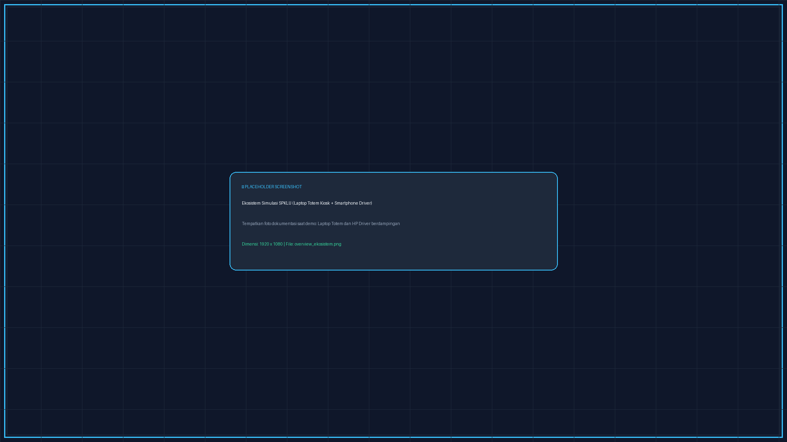
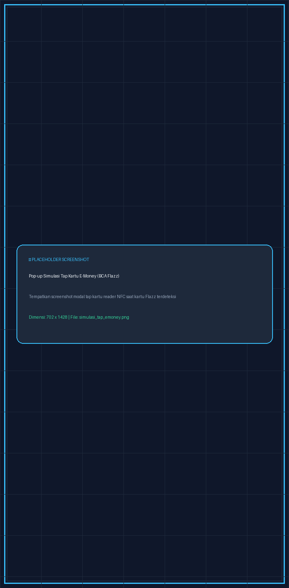
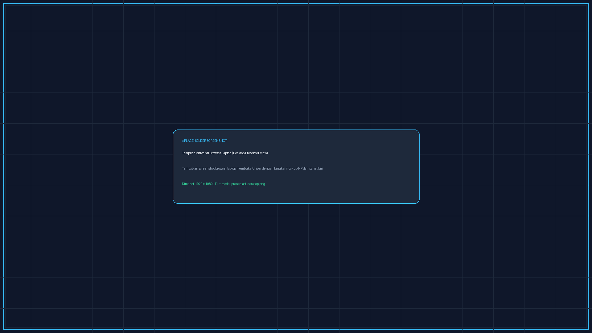

# ⚡ Panduan Pengguna (User Guide): Simulasi EV Charging Station (VOLTX SPKLU)

Selamat datang di **VOLTX EV Charging Station Simulator**. Sistem ini mensimulasikan operasional Stasiun Pengisian Kendaraan Listrik Umum (SPKLU) modern secara *end-to-end*, menghubungkan **Laptop sebagai Totem Kiosk Mesin SPKLU** dan **Smartphone / Browser sebagai Aplikasi Mobile Driver**.


> *Placeholder: Tempatkan foto dokumentasi saat demo (Laptop Totem Kiosk dan Smartphone Driver berdampingan) pada file `static/img/screenshots/overview_ekosistem.png`.*

---

## 📌 1. Gambaran Perangkat & Arsitektur Sistem

> [!NOTE] Konvensi Satuan Simulator (Representasi Skala Nyata)
> - **Watt (W) merepresentasikan KiloWatt (kW):** Pada stasiun SPKLU mobil listrik nyata, daya listrik diukur dalam satuan **kW** (misal 22 kW, 50 kW, hingga 150 kW). Namun pada simulator prototype ini, karena beban fisik pengisian yang digunakan adalah **Smartphone Android nyata** (via kabel USB), satuan daya aktif ditampilkan dalam **Watt (W)** (misal 33 W s/d 66 W) dan kapasitas nozzle ditampilkan dalam **Watt** (22.000 W setara 22 kW, 50.000 W setara 50 kW, 150.000 W setara 150 kW).
> - **Milliampere-hour (mAh) merepresentasikan KiloWatt-hour (kWh):** Pada mobil listrik nyata, kapasitas baterai diukur dalam **kWh** (misal 60 kWh). Pada simulator ini, baterai smartphone memiliki kapasitas nominal **5.000 mAh**. Oleh karena itu, kuota pengisian, argo daya terisi, dan struk transaksi menggunakan satuan **mAh** (dengan basis tarif per 500 mAh).

Sistem ini memadukan perangkat keras konsumen biasa (Laptop & Smartphone Android) menjadi simulator stasiun pengisian daya kendaraan listrik berstandar industri:

1. **Laptop (Totem SPKLU Pintar):**
   - Menjalankan backend server **FastAPI**, basis data **SQLite**, dan transmisi data telemetri berkecepatan tinggi via **WebSockets**.
   - Menampilkan antarmuka layar sentuh publik (**Totem Kiosk Display**) dengan speedometer telemetri daya (W), tegangan, arus, serta status ketersediaan 3 nozzle.
   - Layanan **ADB Battery Monitor** yang memonitor status sambungan fisik USB dan kesehatan baterai HP secara *real-time*.

2. **Smartphone Android (Representasi Mobil Listrik / EV):**
   - Berfungsi ganda: sebagai **Baterai Kendaraan Listrik** nyata (level % baterai asli dibaca via USB) sekaligus sebagai **Aplikasi Mobile Driver** untuk kontrol pengisian.


> *Diagram Arsitektur Alur Sistem: Komunikasi FastAPI, SQLite, ADB Hardware Monitor, dan WebSockets (`static/img/screenshots/diagram_arsitektur_sistem.png`).*

---

## 🚀 2. Cara Menjalankan Aplikasi

1. **Pastikan Prasyarat Terpenuhi:**
   - Python 3.10+ terinstal.
   - Kabel data USB untuk menghubungkan HP Android ke Laptop.
   - Fitur **USB Debugging** aktif di HP Android Anda.
2. **Buka Terminal / PowerShell di folder proyek:**
   ```powershell
   python run.py
   ```
3. **Terminal akan menampilkan banner alamat server:**
   - **Layar Kiosk Laptop:** `http://localhost:8000/kiosk`
   - **Aplikasi Driver (HP):** `http://[IP-LAPTOP]:8000/driver` (disertai QR Code pada terminal)
4. **Membuka di Smartphone (Driver):**
   - Hubungkan HP ke jaringan Wi-Fi yang sama dengan Laptop.
   - Pindai QR Code di layar Kiosk atau buka URL `http://[IP-LAPTOP]:8000/driver`.
5. **Membuka di Laptop (Mode Presenter / Demo Stakeholder):**
   - Buka tab `http://localhost:8000/kiosk` untuk layar Totem Kiosk.
   - Buka tab `http://localhost:8000/driver` untuk aplikasi Driver dalam bingkai mockup smartphone interaktif yang rapi tanpa scrollbar.

> [!TIP] Ingin Membawa Demo ke Laptop Lain?
> Jika Anda menjalankan simulator ini di laptop baru (kantor, kampus, juri, atau klien), penomoran port colokan USB motherboard mungkin berbeda. Baca panduan praktis dan langkah setup cepat pada [**`SETUP_DEMO_LAPTOP_LAIN.md`**](file:///C:/Users/soult/Downloads/charging-station/SETUP_DEMO_LAPTOP_LAIN.md) atau jalankan script kalibrasi `python calibrate_ports.py`.

---

## 🖥️ 3. Antarmuka Layar Kiosk Laptop (Totem SPKLU Standby)

Layar Kiosk bertindak sebagai monitor display utama pada totem stasiun pengisian publik saat standby:


> *Tangkapan Layar: Layar monitor Totem Kiosk Display saat kondisi standby (`static/img/screenshots/tampilan awal mesin.png`).*

### Komponen Utama Layar Kiosk:
1. **Dynamic Station QR Code (Kiri):** Memudahkan driver memindai alamat stasiun untuk langsung membuka aplikasi web di HP mereka.
2. **Speedometer Live Telemetri (Tengah):** Mengukur telemetri listrik secara *real-time*:
   - **Daya Aktif:** Speedometer daya listrik aktif riil dalam Watt (W) (saat standby jarum di 0 W).
   - **Tegangan & Arus:** Volt (230V AC / 400V DC) dan Ampere dinamis.
   - **Frekuensi & Suhu:** Frekuensi stabil 50.0 Hz dan temperatur operasi stasiun (34°C - 36°C).
   - **Total Energi Terakumulasi:** Menghitung total daya terakumulasi (mAh) yang telah disalurkan stasiun sepanjang hari.
3. **Kartu Status 3 Nozzle (Kanan):**
   - **Nozzle 1 — AC Normal (Type 2):** Max 22.000 W (22 kW) | Tarif Rp 2.466 / 500 mAh.
   - **Nozzle 2 — DC Fast (CHAdeMO):** Max 50.000 W (50 kW) | Tarif Rp 3.000 / 500 mAh.
   - **Nozzle 3 — DC Ultra-Fast (CCS2):** Max 150.000 W (150 kW) | Tarif Rp 3.500 / 500 mAh.
   - Dilengkapi **QR Code khusus per nozzle** (`/driver?nozzle=X`) untuk alur scan langsung dari totem.
   - **Indikator Status Nozzle:**
     - 🟢 **STANDBY / TERSEDIA:** Siap digunakan driver.
     - 🟡 **KABEL TERCOLOK:** Kabel fisik terhubung ke HP, menunggu otorisasi sesi.
     - 🔴 **MENGISI DAYA:** Arus listrik aktif mengalir ke baterai.

---

## 📱 4. Alur Aplikasi Mobile Driver (Step-by-Step Flow)

Aplikasi Driver didesain dengan antarmuka mobile-first yang bersih, modern, dan intuitif:

---

### Langkah 1: Masuk Akun, Scan QR & Sambungkan Kabel Nozzle (Alur Bertahap)

Tahapan awal mencakup otorisasi pengemudi, penentuan nozzle melalui pemindaian kamera, serta verifikasi sambungan fisik kabel USB.

#### 1.1 Halaman Login Akun Driver
Driver membuka aplikasi dan masuk menggunakan akun terdaftar atau menggunakan tombol cepat **1-Klik Akun Demo**:
- 👤 **Budi Santoso (`driver1` / `password123`)** — Saldo Dompet: Rp 150.000
- 👤 **Siti Rahma (`driver2` / `password123`)** — Saldo Dompet: Rp 200.000


> *Tangkapan Layar: Form login pengemudi dengan tombol 1-klik akun demo (`static/img/screenshots/form login.png`).*

#### 1.2 Beranda Driver & Pemilihan Nozzle
Setelah login, beranda menampilkan saldo dompet pengemudi, tombol scan QR stasiun/nozzle, dan daftar 3 kartu nozzle yang tersedia.


> *Tangkapan Layar: Beranda aplikasi Driver dan tombol scan QR nozzle (`static/img/screenshots/scan qr - home page.png`).*

#### 1.3 Pemindaian QR Code Nozzle via Kamera HP
Driver mengklik tombol hijau **"📷 Scan QR Nozzle SPKLU"**. Sistem membuka viewfinder kamera interaktif di HP untuk memindai QR Code nozzle tertentu langsung dari monitor Totem Kiosk laptop.


> *Tangkapan Layar: Viewfinder kamera HP memindai QR Code Nozzle 1 di layar Totem Kiosk (`static/img/screenshots/scan qr - bagian awal.png`).*

#### 1.4 Status Menunggu Sambungan Kabel Fisik Nozzle
Begitu QR nozzle dipindai (misal Nozzle 1), sistem mengunci nozzle tersebut dan menampilkan kartu instruksi:
> *🔌 Menunggu Sambungan Kabel USB... Silakan ambil nozzle Nozzle 1 dari totem SPKLU dan hubungkan kabel ke HP Anda.*

Tersedia pula tombol **"⚡ Colok Simulasi (Bypass Tanpa Kabel Fisik)"** untuk kemudahan demonstrasi tanpa kabel USB nyata.


> *Tangkapan Layar: Instruksi menghubungkan kabel fisik nozzle ke HP (`static/img/screenshots/scan qr - menunggu colokan fisik.png`).*

#### 1.5 Dialog Proteksi Sambungan Kabel (Safety Guard)
Apabila pengemudi mencoba melanjutkan proses sebelum kabel USB dicolokkan ke HP, sistem secara cerdas menampilkan dialog peringatan keselamatan untuk memastikan kabel terpasang kokoh terlebih dahulu.


> *Tangkapan Layar: Peringatan proteksi jika kabel nozzle belum tercolok (`static/img/screenshots/alert untuk mencolokan kabel.png`).*

#### 1.6 Konfirmasi Kabel Berhasil Terhubung & Auto-Next
Ketika kabel fisik USB ditancapkan ke port laptop dan terhubung ke HP, sensor background mendeteksi sinyal perangkat secara otomatis. Dialog konfirmasi centang hijau muncul dan sistem **otomatis berpindah ke Langkah 2 (Target Cas)**.


> *Tangkapan Layar: Notifikasi sukses kabel terdeteksi dan auto-next (`static/img/screenshots/pop up kabel tercolok.png`).*

---

### Langkah 2: Menentukan Target Pengisian & Kalkulasi Biaya

Pada tahapan ini, aplikasi mendeteksi kapasitas dan level baterai fisik HP secara otomatis melalui ADB:


> *Tangkapan Layar: Antarmuka Langkah 2 - Target Cas & Kalkulasi Deposit (`static/img/screenshots/target cas.png`).*

1. **Deteksi Baterai HP Fisik:** Baterai fisik HP terbaca secara *real-time* (misal: 57% SoC).
2. **Pilihan Target Pengisian:**
   - **Isi Penuh (100%):** Sistem menghitung sisa daya yang diperlukan hingga baterai 100% (contoh: 2.150 mAh).
   - **Input Manual (mAh):** Pengemudi bebas menentukan kuota pengisian yang diinginkan (misal: 500 mAh, 1.000 mAh).
3. **Kalkulasi Biaya Transparan:**
   - Kuota Daya Dibutuhkan: **2.150 mAh**
   - Estimasi Waktu Pengisian: **45 Menit**
   - Estimasi Biaya Deposit (Hold): **Rp 10.604** (berdasarkan tarif Nozzle 1 Rp 2.466 / 500 mAh)
4. Klik tombol **Lanjut ke Pembayaran ➜**.

---

### Langkah 3: Metode Pembayaran & Simulasi Tap Kartu E-Money

Sistem VOLTX SPKLU mendukung 3 varian pembayaran modern: Saldo Dompet Akun, QRIS Dinamis, serta Kartu E-Money / RFID Contactless.

#### 3.1 Menu Pilihan Metode Pembayaran
Driver memilih salah satu dari metode pembayaran yang tersedia. Deposit awal yang di-hold dijamin aman dan sisa saldo yang tidak terpakai akan otomatis dikembalikan 100% saat pengisian selesai.


> *Tangkapan Layar: Halaman pemilihan metode pembayaran Step 3 (`static/img/screenshots/payment method.png`).*

#### 3.2 Simulasi Interaktif Tap Kartu E-Money (BCA Flazz / Mandiri e-money)
Saat memilih opsi **Kartu E-Money / RFID** dan menekan tombol **"💳 TAP KARTU & CAS SEKARANG"**, muncul pop-up simulasi reader contactless NFC:


> *Placeholder: Tempatkan tangkapan layar modal tap kartu reader saat kartu Flazz terdeteksi pada file `static/img/screenshots/simulasi_tap_emoney.png`.*

- **Alur Interaktif Tap Kartu:**
  1. Sentuh / klik area reader kartu contactless `📶`.
  2. Seketika kartu virtual terdeteksi menampilkan rincian:
     - Jenis Kartu: **BCA FLAZZ**
     - Nomor ID: **BCA - 6656**
     - Pemilik: **BCA Flazz (Demo #6656)**
     - Saldo Kartu: **Rp 149.790** (Saldo otomatis mencukupi untuk demo)
  3. Sistem memproses verifikasi selama **2 detik**.
  4. Muncul notifikasi konfirmasi **Transaksi Berhasil!** dan sistem **otomatis memulai sesi pengisian aktif**.

---

### Langkah 4: Pengisian Berlangsung & Live Telemetri (Tampilan Ganda / Dual Display)

Selama pengisian berlangsung, telemetri daya diperbarui setiap detik via WebSockets pada kedua layar:

#### 4.1 Tampilan Smartphone Driver
Menampilkan circular battery gauge (58.0% SoC), status arus aktif (Charging...), live power **66.0 W**, energi tersalurkan **48 mAh**, biaya pemakaian riil berjalan **Rp 237**, sisa deposit aman **Rp 10.367**, serta tombol darurat **"🛑 BERHENTI SEKARANG (STOP & REFUND)"**.


> *Tangkapan Layar: Antarmuka pengisian aktif pada Smartphone Driver (`static/img/screenshots/user ketika charging.png`).*

#### 4.2 Tampilan Monitor Totem Kiosk Laptop
Menampilkan jarum speedometer analog-digital bergerak di **65 W**, tegangan **230 V**, arus **0.28 A**, frekuensi **50.0 Hz**, suhu stasiun **36°C**, total energi sesi **300 mAh**, total biaya **Rp 1.480**, serta kartu Nozzle 1 dalam status **MENGISI DAYA** (63% SoC).


> *Tangkapan Layar: Antarmuka pengisian aktif pada Layar Totem Kiosk Laptop (`static/img/screenshots/mechine when charging.png`).*

#### Mekanisme Penghentian Pengisian & Proteksi:
- **Otomatis:** Arus listrik berhenti seketika saat target baterai 100% atau kuota mAh tercapai.
- **Manual:** Driver dapat menekan tombol **🛑 BERHENTI SEKARANG (STOP & REFUND)** kapan saja.
- **Proteksi Safety (Cabut Kabel Mid-Charge):** Jika kabel USB dicabut paksa saat pengisian berlangsung, sensor hardware seketika memicu cutoff darurat, menghentikan argo biaya, mengembalikan sisa deposit ke dompet, dan mengembalikan nozzle ke status `STANDBY`.

---

### Langkah 5: Struk Digital & Auto-Refund Seketika (Tampilan Ganda / Dual Display)

Begitu sesi pengisian selesai, sistem menyelesaikan kalkulasi keuangan transparan secara *real-time*:

#### 5.1 Tampilan Struk Digital Smartphone Driver
Struk resmi transaksi digital EV terbit di layar HP:
- **Nomor Sesi:** Misal `#EV-260912-5AA796`
- **Durasi Pengisian:** `01:23` (Menit:Detik)
- **Total Energi Terisi:** **378 mAh**
- **Biaya Riil Pemakaian:** **Rp 1.864**
- **Deposit Awal:** **Rp 10.604**
- **Pengembalian Dana (Refund):** **Rp 8.740** (100% sisa saldo seketika kembali ke akun)


> *Tangkapan Layar: Struk digital resmi dan bukti refund pada HP Driver (`static/img/screenshots/struk pengisian user.png`).*

#### 5.2 Tampilan Notifikasi Selesai Totem Kiosk Laptop
Pada monitor Totem Kiosk mesin, jendela modal notifikasi stasiun muncul memberitahukan penyelesaian sesi pengisian (*"Pengisian Selesai! Energi: 378 mAh | Biaya: Rp 1.864 | Refund: Rp 8.740"*), speedometer kembali ke 0 W, dan nozzle kembali siap digunakan oleh pengemudi berikutnya.


> *Tangkapan Layar: Notifikasi penyelesaian pengisian pada Layar Totem Kiosk Mesin (`static/img/screenshots/pop up ketika mesin selesai.png`).*

---

## 🎛️ 5. Mode Presentasi Stakeholder (Desktop Mockup View)

Saat aplikasi Driver dibuka di layar laptop desktop (`http://localhost:8000/driver`), sistem secara otomatis menampilkan antarmuka khusus presenter:


> *Placeholder: Tempatkan screenshot browser laptop membuka `/driver` dengan bingkai mockup HP dan panel presenter kiri pada file `static/img/screenshots/mode_presentasi_desktop.png`.*

1. **Mockup Smartphone Elegan:** Tampilan aplikasi dibingkai dalam bentuk fisik smartphone modern tanpa scrollbar browser yang mengganggu.
2. **Panel Kontrol Presenter (Kiri):**
   - Info status deteksi kabel hardware USB (ADB).
   - Tombol ganti akun cepat (Budi Santoso / Siti Rahma).
   - Tombol **🔄 Reset Sesi Stasiun (1-Klik):** Mengembalikan seluruh stasiun ke kondisi awal bersih seketika apabila dibutuhkan selama demonstrasi.

---

## 📸 6. Panduan Penggantian Screenshot & Daftar Berkas Lengkap

Folder `static/img/screenshots/` telah disiapkan dengan rapi. Seluruh 13 tangkapan layar yang Anda sediakan telah langsung terintegrasi, ditambah 4 berkas placeholder bersih yang siap ditimpa kapan saja:

| No | Lokasi File Gambar | Bagian Dokumen / Alur | Tipe Perangkat | Status Berkas | Rekomendasi Resolusi |
| :-: | :--- | :--- | :--- | :---: | :--- |
| **01** | `static/img/screenshots/overview_ekosistem.png` | Bagian 1: Overview Ekosistem | Foto Dokumentasi Fisik | 🟡 *Placeholder* | 1920 x 1080 (16:9 Landscape) |
| **02** | `static/img/screenshots/diagram_arsitektur_sistem.png` | Bagian 1: Arsitektur Sistem | Diagram Bagan Alur | 🟢 *Sudah Ada* | 1200 x 675 (Landscape) |
| **03** | `static/img/screenshots/tampilan awal mesin.png` | Bagian 3: Totem Kiosk Standby | Layar Laptop Totem Kiosk | 🟢 **Screenshot Asli** | 1921 x 853 (Landscape) |
| **04** | `static/img/screenshots/form login.png` | Alur 1.1: Form Login Driver | Layar Smartphone Driver | 🟢 **Screenshot Asli** | 702 x 1428 (Portrait Mobile) |
| **05** | `static/img/screenshots/scan qr - home page.png` | Alur 1.2: Beranda Driver & 3 Nozzle | Layar Smartphone Driver | 🟢 **Screenshot Asli** | 702 x 1428 (Portrait Mobile) |
| **06** | `static/img/screenshots/scan qr - bagian awal.png` | Alur 1.3: Kamera Scanner QR | Layar Smartphone Driver | 🟢 **Screenshot Asli** | 702 x 1428 (Portrait Mobile) |
| **07** | `static/img/screenshots/scan qr - menunggu colokan fisik.png` | Alur 1.4: Status Menunggu Colokan | Layar Smartphone Driver | 🟢 **Screenshot Asli** | 702 x 1428 (Portrait Mobile) |
| **08** | `static/img/screenshots/alert untuk mencolokan kabel.png` | Alur 1.5: Dialog Proteksi Kabel | Layar Smartphone Driver | 🟢 **Screenshot Asli** | 702 x 1428 (Portrait Mobile) |
| **09** | `static/img/screenshots/pop up kabel tercolok.png` | Alur 1.6: Konfirmasi Kabel Terhubung | Layar Smartphone Driver | 🟢 **Screenshot Asli** | 702 x 1428 (Portrait Mobile) |
| **10** | `static/img/screenshots/target cas.png` | Alur 2: Target Cas & Kalkulasi | Layar Smartphone Driver | 🟢 **Screenshot Asli** | 702 x 1428 (Portrait Mobile) |
| **11** | `static/img/screenshots/payment method.png` | Alur 3.1: Menu Pembayaran | Layar Smartphone Driver | 🟢 **Screenshot Asli** | 702 x 1428 (Portrait Mobile) |
| **12** | `static/img/screenshots/simulasi_tap_emoney.png` | Alur 3.2: Modal Tap Kartu E-Money | Layar Smartphone Driver | 🟡 *Placeholder* | 702 x 1428 (Portrait Mobile) |
| **13** | `static/img/screenshots/user ketika charging.png` | Alur 4.1: Pengisian Aktif di HP | Layar Smartphone Driver | 🟢 **Screenshot Asli** | 702 x 1428 (Portrait Mobile) |
| **14** | `static/img/screenshots/mechine when charging.png` | Alur 4.2: Kiosk saat Mengisi | Layar Laptop Totem Kiosk | 🟢 **Screenshot Asli** | 1921 x 1207 (Landscape) |
| **15** | `static/img/screenshots/struk pengisian user.png` | Alur 5.1: Struk Digital & Refund | Layar Smartphone Driver | 🟢 **Screenshot Asli** | 702 x 1428 (Portrait Mobile) |
| **16** | `static/img/screenshots/pop up ketika mesin selesai.png` | Alur 5.2: Pop-up Kiosk Selesai | Layar Laptop Totem Kiosk | 🟢 **Screenshot Asli** | 1921 x 853 (Landscape) |
| **17** | `static/img/screenshots/mode_presentasi_desktop.png` | Bagian 5: Mode Presentasi Laptop | Layar Browser Laptop | 🟡 *Placeholder* | 1920 x 1080 (16:9 Landscape) |

---

## ❓ 7. Tanya Jawab & Troubleshooting (FAQ)

| Gejala / Pertanyaan | Penyebab Umum | Langkah Solusi |
| :--- | :--- | :--- |
| **Status kabel tertulis "Belum Tercolok" padahal HP sudah dicolok ke laptop?** | USB Debugging belum aktif atau izin otorisasi RSA belum disetujui di layar HP. | Buka *Pengaturan HP > Opsi Pengembang > Aktifkan USB Debugging*. Saat muncul jendela pop-up di layar HP, centang *"Selalu izinkan dari komputer ini"* dan klik **OK**. |
| **Apa yang terjadi jika kabel USB dicabut paksa saat mengecas?** | Sensor kehadiran hardware mendeteksi kabel terputus secara mendadak. | Sistem keselamatan otomatis memicu cutoff darurat, menghentikan argo pengisian (mAh), menghitung biaya riil hingga detik terakhir, me-refund sisa deposit ke dompet akun, dan mengembalikan nozzle ke status `STANDBY`. |
| **Apakah harus mencolokkan kabel ke port USB tertentu?** | Sistem mendukung pemetaan port otomatis. | Colokkan ke port USB mana saja di laptop. Anda dapat memetakan port dalam 1 detik via tombol di panel presenter laptop (`/driver`), menggunakan script `python calibrate_ports.py`, atau membaca panduan lengkap di [**`SETUP_DEMO_LAPTOP_LAIN.md`**](file:///C:/Users/soult/Downloads/charging-station/SETUP_DEMO_LAPTOP_LAIN.md). |
| **Bagaimana jika ingin demonstrasi tanpa membawa kabel USB fisik?** | Ingin melakukan simulasi software secara mandiri tanpa device Android. | Pada modal panduan colok kabel, klik tombol **"⚡ Colok Simulasi (Bypass Tanpa Kabel Fisik)"**. Sistem akan mensimulasikan sambungan kabel secara virtual. |
| **Saldo dompet kurang saat ingin mulai cas?** | Saldo akun berada di bawah estimasi deposit minimum. | Klik tombol ikon **`+`** di sebelah saldo akun di pojok kanan atas aplikasi Driver untuk melakukan Top-Up instan (Rp 50.000 s/d Rp 200.000). |
| **Bagaimana mereset stasiun jika terjadi kendala saat demo?** | Sesi sebelumnya belum diselesaikan secara normal. | Pada layar `/driver` (tampilan laptop), klik tombol **🔄 Reset Sesi Stasiun (1-Klik)** di panel sebelah kiri. Seluruh konektor seketika kembali kosong dan deposit yang tersisa dikembalikan ke akun driver. |
