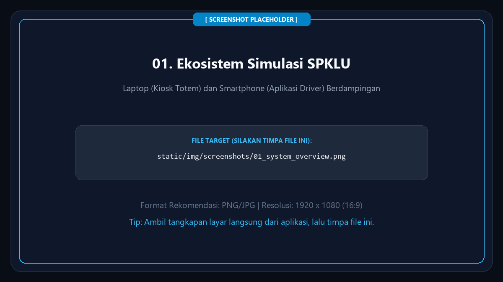
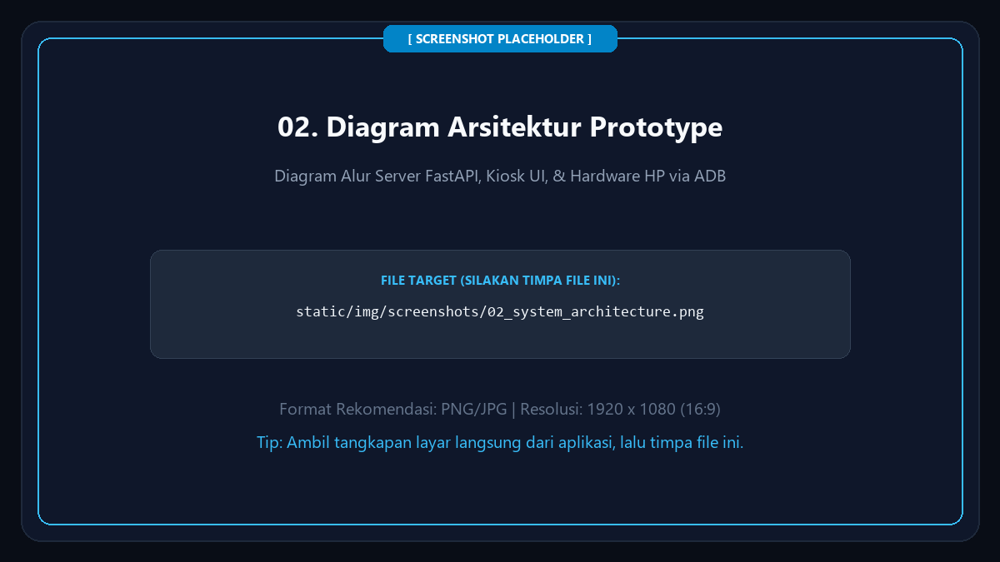
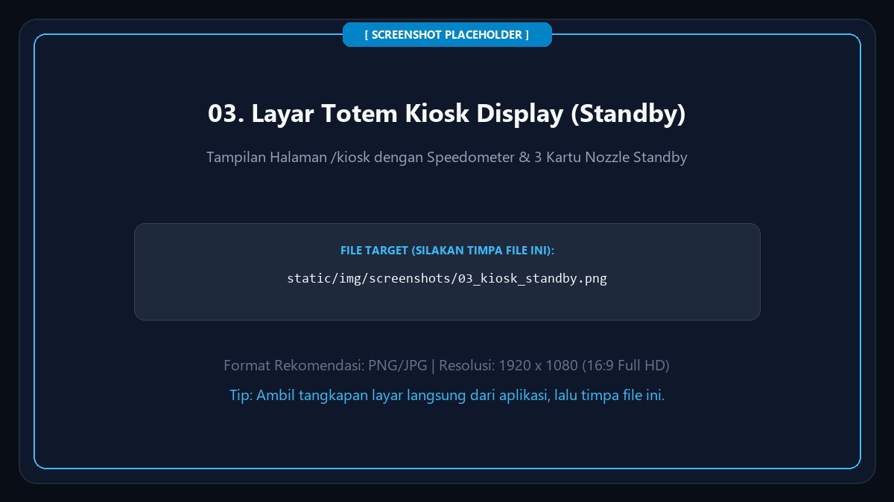
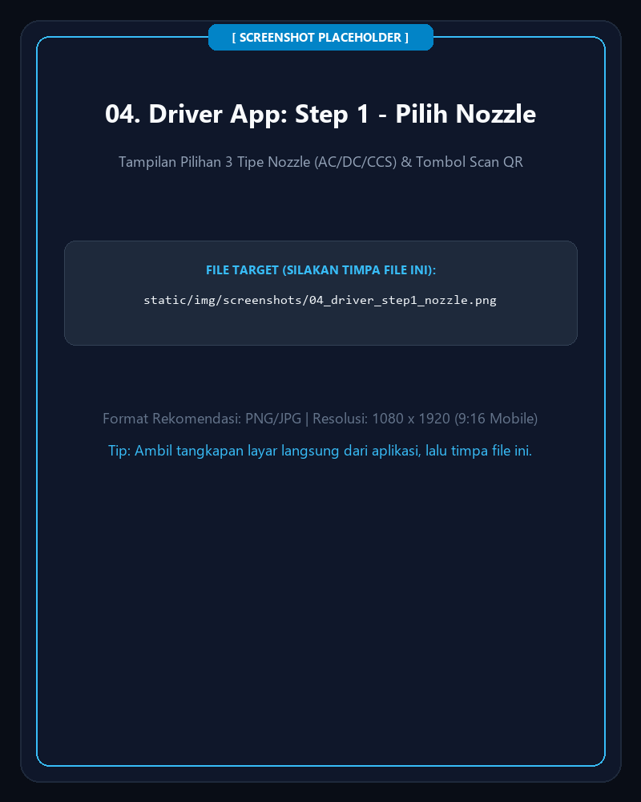
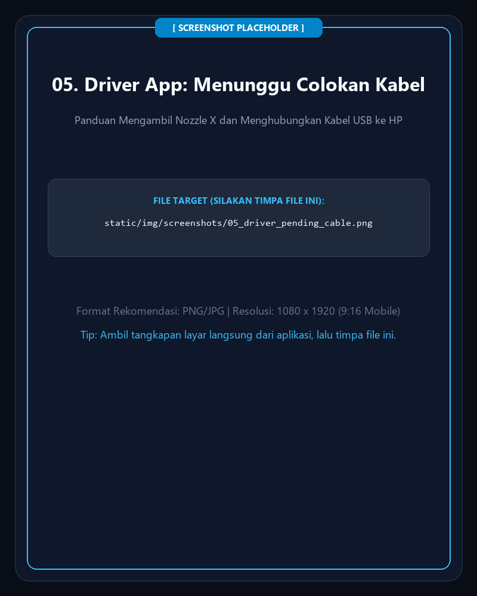
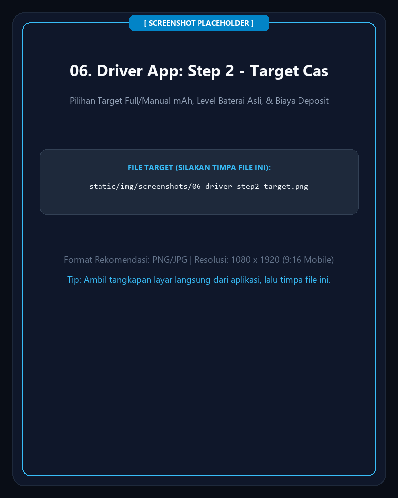
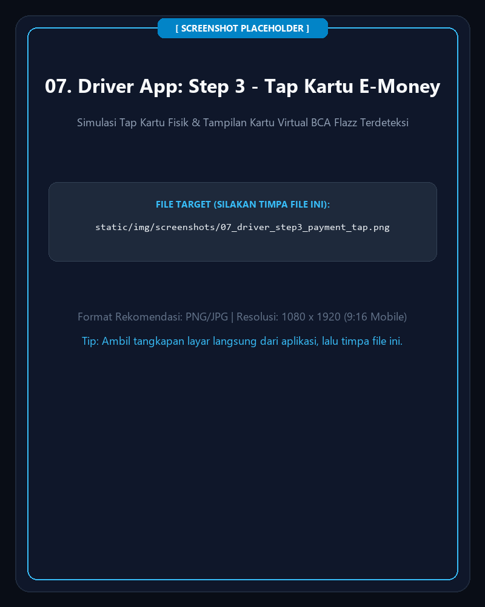
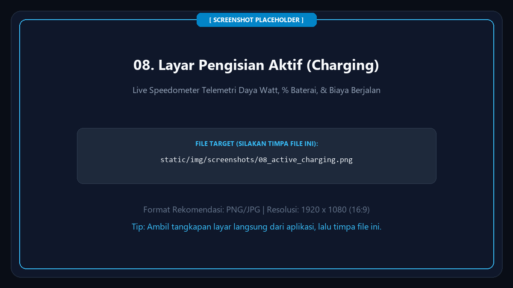
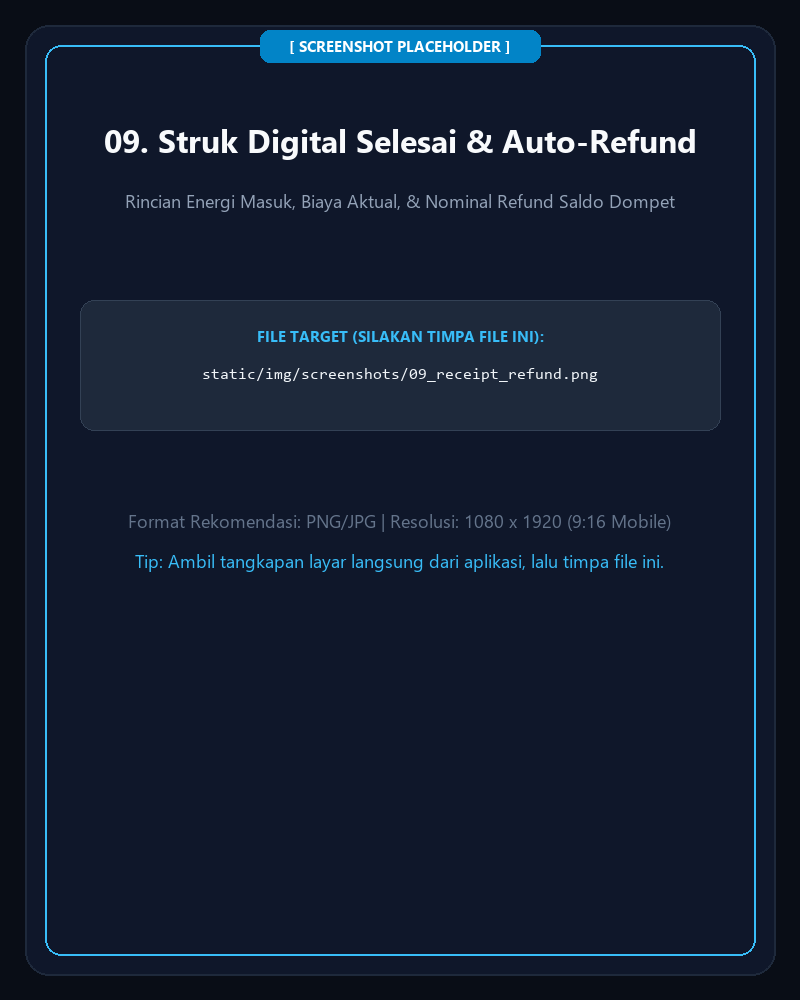
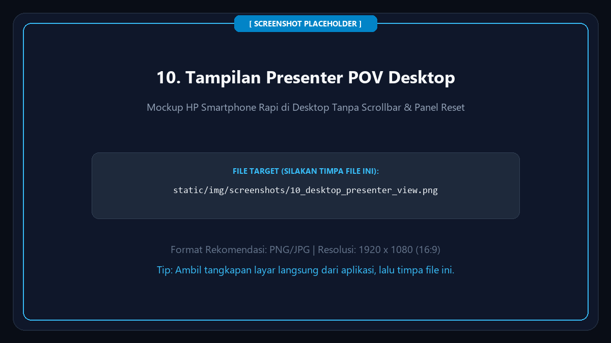

# ⚡ Panduan Pengguna (User Guide): Simulasi EV Charging Station (VOLTX SPKLU)

Selamat datang di **VOLTX EV Charging Station Simulator**. Sistem ini mensimulasikan operasional Stasiun Pengisian Kendaraan Listrik Umum (SPKLU) modern secara *end-to-end*, menghubungkan **Laptop sebagai Totem Kiosk Mesin SPKLU** dan **Smartphone / Browser sebagai Aplikasi Mobile Driver**.


> *Placeholder: Tempatkan foto / screenshot Laptop (Kiosk Totem) dan Smartphone (Aplikasi Driver) berdampingan pada file `static/img/screenshots/01_system_overview.png`.*

---

## 📌 1. Gambaran Perangkat & Arsitektur Sistem

> [!NOTE] Konvensi Satuan Simulator (Representasi Skala Nyata)
> - **Watt (W) merepresentasikan KiloWatt (kW):** Pada stasiun SPKLU mobil listrik nyata, daya listrik diukur dalam satuan **kW** (misal 22 kW, 50 kW, hingga 150 kW). Namun pada simulator prototype ini, karena beban fisik pengisian yang digunakan adalah **Smartphone Android nyata** (via kabel USB), satuan daya aktif ditampilkan dalam **Watt (W)** (misal 33 W) dan kapasitas nozzle ditampilkan dalam **Watt** (22.000 W setara 22 kW, 50.000 W setara 50 kW, 150.000 W setara 150 kW).
> - **Milliampere-hour (mAh) merepresentasikan KiloWatt-hour (kWh):** Pada mobil listrik nyata, kapasitas baterai diukur dalam **kWh** (misal 60 kWh). Pada simulator ini, baterai smartphone memiliki kapasitas nominal **5.000 mAh**. Oleh karena itu, kuota pengisian, argo daya terisi, dan struk transaksi menggunakan satuan **mAh** (dengan basis tarif per 500 mAh).

Sistem ini memadukan perangkat keras konsumen biasa (Laptop & Smartphone Android) menjadi simulator stasiun pengisian daya kendaraan listrik berstandar industri:

1. **Laptop (Totem SPKLU Pintar):**
   - Menjalankan backend server **FastAPI**, basis data **SQLite**, dan transmisi data telemetri berkecepatan tinggi via **WebSockets**.
   - Menampilkan antarmuka layar sentuh publik (**Totem Kiosk Display**) dengan speedometer telemetri daya (W), tegangan, arus, serta status ketersediaan 3 nozzle.
   - Layanan **ADB Battery Monitor** yang memonitor status sambungan fisik USB dan kesehatan baterai HP secara *real-time*.

2. **Smartphone Android (Representasi Mobil Listrik / EV):**
   - Berfungsi ganda: sebagai **Baterai Kendaraan Listrik** nyata (level % baterai asli dibaca via USB) sekaligus sebagai **Aplikasi Mobile Driver** untuk kontrol pengisian.


> *Placeholder: Tempatkan diagram arsitektur alur perangkat pada file `static/img/screenshots/02_system_architecture.png`.*

---

## 🚀 2. Cara Menjalankan Aplikasi

1. **Pastikan Prasyarat Terpenuhi:**
   - Python 3.10+ terinstal.
   - Kabel data USB untuk menghubungkan HP Android ke Laptop.
   - Fitur **USB Debugging** aktif di HP Android Anda.
2. **Buka Terminal / PowerShell di folder proyek:**
   ```powershell
   python run.py
   ```
3. **Terminal akan menampilkan banner alamat server:**
   - **Layar Kiosk Laptop:** `http://localhost:8000/kiosk`
   - **Aplikasi Driver (HP):** `http://[IP-LAPTOP]:8000/driver` (disertai QR Code pada terminal)
4. **Membuka di Smartphone (Driver):**
   - Hubungkan HP ke jaringan Wi-Fi yang sama dengan Laptop.
   - Pindai QR Code di layar Kiosk atau buka URL `http://[IP-LAPTOP]:8000/driver`.
5. **Membuka di Laptop (Mode Presenter / Demo Stakeholder):**
   - Buka tab `http://localhost:8000/kiosk` untuk layar Totem Kiosk.
   - Buka tab `http://localhost:8000/driver` untuk aplikasi Driver dalam bingkai mockup smartphone interaktif yang rapi tanpa scrollbar.

---

## 🖥️ 3. Antarmuka Layar Kiosk Laptop (Totem SPKLU)

Layar Kiosk bertindak sebagai monitor display utama pada totem stasiun pengisian publik:


> *Placeholder: Tempatkan screenshot browser layar penuh halaman `/kiosk` saat standby pada file `static/img/screenshots/03_kiosk_standby.png`.*

### Komponen Utama Layar Kiosk:
1. **Dynamic Station QR Code (Kiri):** Memudahkan driver memindai alamat stasiun untuk langsung membuka aplikasi.
2. **Speedometer Live Telemetri (Tengah):** Mengukur telemetri listrik secara *real-time*:
   - **Daya Aktif:** Speedometer daya listrik aktif riil dalam Watt (W).
   - **Tegangan & Arus:** Volt (230V AC / 400V DC) dan Ampere dinamis.
   - **Frekuensi & Suhu:** Frekuensi stabil 50.0 Hz dan temperatur operasi stasiun.
   - **Total Energi Terakumulasi:** Menghitung total daya terakumulasi (mAh) yang telah disalurkan stasiun.
3. **Kartu Status 3 Nozzle (Kanan):**
   - **Nozzle 1 — AC Normal (Type 2):** Max 22.000 W (22 kW) | Tarif Rp 2.466 / 500 mAh.
   - **Nozzle 2 — DC Fast (CHAdeMO):** Max 50.000 W (50 kW) | Tarif Rp 3.000 / 500 mAh.
   - **Nozzle 3 — DC Ultra-Fast (CCS2):** Max 150.000 W (150 kW) | Tarif Rp 3.500 / 500 mAh.
   - Dilengkapi **QR Code khusus per nozzle** (`/driver?nozzle=X`) untuk alur scan langsung dari totem.
   - **Indikator Status Nozzle:**
     - 🟢 **STANDBY / TERSEDIA:** Siap digunakan driver.
     - 🟡 **KABEL TERCOLOK:** Kabel fisik terhubung ke HP, menunggu otorisasi sesi.
     - 🔴 **MENGISI DAYA:** Arus listrik aktif mengalir ke baterai.

---

## 📱 4. Alur Aplikasi Mobile Driver (Step-by-Step Flow)

Aplikasi Driver didesain dengan antarmuka mobile-first yang bersih, modern, dan intuitif:

### Langkah 1: Masuk Akun & Memilih Nozzle


> *Placeholder: Tempatkan screenshot aplikasi Driver Step 1 pada file `static/img/screenshots/04_driver_step1_nozzle.png`.*

1. Buka aplikasi Driver di HP atau mode mockup browser laptop.
2. Masuk menggunakan akun terdaftar atau gunakan **Akun Cepat 1-Klik**:
   - 👤 **Budi Santoso (`driver1` / `password123`)** — Saldo Dompet: Rp 150.000
   - 👤 **Siti Rahma (`driver2` / `password123`)** — Saldo Dompet: Rp 200.000
3. Tentukan nozzle dengan salah satu dari 2 cara:
   - **Pindai QR Code Nozzle:** Klik tombol *Scan QR Nozzle* dan arahkan kamera ke QR nozzle di layar Kiosk.
   - **Pilih Manual:** Klik kartu Nozzle 1, Nozzle 2, atau Nozzle 3.

#### Panduan Menghubungkan Kabel (Pending Nozzle State):


> *Placeholder: Tempatkan screenshot panduan colok kabel nozzle pada file `static/img/screenshots/05_driver_pending_cable.png`.*

- Jika kabel USB belum dicolokkan ke HP, sistem menampilkan instruksi yang jelas:
  > *🔌 Silakan ambil nozzle Nozzle X dari totem SPKLU dan hubungkan kabel ke HP Anda.*
- Begitu kabel fisik USB dicolokkan ke port laptop dan HP terdeteksi (atau mode simulasi aktif), sistem **otomatis melangkah ke Step 2 (Target Cas)**.

---

### Langkah 2: Menentukan Target Pengisian & Kalkulasi Biaya


> *Placeholder: Tempatkan screenshot Step 2 Target Cas pada file `static/img/screenshots/06_driver_step2_target.png`.*

1. **Status Baterai HP Terbaca Otomatis:** Sistem mendeteksi persentase baterai fisik HP Anda secara *live* melalui ADB.
2. **Pilihan Target Pengisian:**
   - **Charge Full (100%):** Baterai diisi hingga kapasitas maksimal.
   - **Input Manual (mAh):** Driver bebas menentukan kuota daya (misal: `+1.000 mAh`).
3. **Kalkulasi Estimasi Transparan:**
   - Daya yang dibutuhkan (mAh).
   - Estimasi waktu pengisian (menit).
   - Estimasi biaya deposit yang akan di-hold sementara.
4. Klik tombol **Lanjut ke Pembayaran ➜**.

---

### Langkah 3: Pembayaran & Simulasi Tap Kartu E-Money

Pilih salah satu dari 3 metode pembayaran yang didukung:
- 💳 **Saldo Dompet (Wallet Aplikasi):** Pemotongan instan dari saldo akun.
- 📱 **QRIS Dinamis:** Pindai kode QRIS dinamis yang dihasilkan sistem.
- 💳 **Kartu E-Money / RFID (Interaktif Tap):**


> *Placeholder: Tempatkan screenshot pop-up kartu E-Money yang terdeteksi pada file `static/img/screenshots/07_driver_step3_payment_tap.png`.*

#### Alur Interaktif Tap Kartu E-Money:
1. Pilih opsi pembayaran **Kartu E-Money / RFID**.
2. Klik tombol **💳 TAP KARTU & CAS SEKARANG**.
3. Jendela pop-up simulasi tap kartu akan muncul dengan tampilan reader contactless `📶`.
4. **Sentuh / Klik area kartu:**
   - Seketika kartu virtual terdeteksi menampilkan rincian:
     - Jenis Kartu: **BCA FLAZZ**
     - Nomor ID: **BCA - 6656**
     - Pemilik Kartu: **BCA Flazz (Demo #6656)**
     - Saldo Tersedia: **Rp 149.790** (Saldo otomatis mencukupi untuk demo)
5. Sistem memproses verifikasi selama **2 detik**.
6. Muncul notifikasi konfirmasi **Transaksi Berhasil!** dan sistem **otomatis melanjutkan langsung ke pengisian aktif**.

---

### Langkah 4: Pengisian Berlangsung & Live Telemetri


> *Placeholder: Tempatkan screenshot layar pengisian aktif (Active Charging View) pada file `static/img/screenshots/08_active_charging.png`.*

- **Dial Telemetri Melingkar:** Persentase baterai HP bertambah, jarum speedometer bergerak.
- **Monitoring Parameter Daya:**
  - Daya riil dalam Watt (W).
  - Akumulasi energi tersalurkan dalam **mAh**.
  - Biaya aktual pemakaian yang berjalan secara real-time.
  - Sisa saldo deposit yang aman.
- **Mekanisme Penghentian Pengisian:**
  - **Otomatis:** Arus listrik berhenti begitu target baterai 100% atau kuota mAh tercapai.
  - **Manual:** Klik tombol **🛑 BERHENTI SEKARANG (STOP & REFUND)** kapan saja.
  - **Proteksi Safety (Cabut Kabel Mid-Charge):** Jika kabel USB dicabut paksa saat pengisian berlangsung, sistem seketika melakukan auto-cutoff, menyetop argo biaya, mengembalikan sisa deposit ke dompet, dan mengembalikan nozzle ke status `STANDBY`.

---

### Langkah 5: Struk Digital & Auto-Refund Seketika


> *Placeholder: Tempatkan screenshot struk digital pada file `static/img/screenshots/09_receipt_refund.png`.*

Begitu sesi pengisian selesai:
1. Struk digital resmi muncul seketika di layar HP:
   - **Nomor Sesi:** Misal `#EV-260912-F964AD`
   - **Total Energi Terisi:** Dihitung akurat dalam mAh.
   - **Deposit Awal:** Nominal saldo yang di-hold saat memulai.
   - **Biaya Riil Pemakaian:** Biaya energi yang benar-benar terserap.
   - **Sisa Saldo yang Dikembalikan (Refund):** 100% sisa deposit seketika dikembalikan ke saldo dompet akun Anda.
2. Nozzle di Kiosk Totem dan Driver seketika kembali ke status **STANDBY / TERSEDIA** untuk pengguna berikutnya.

---

## 🎛️ 5. Mode Presentasi Stakeholder (Desktop Mockup View)


> *Placeholder: Tempatkan screenshot tampilan browser laptop halaman `/driver` pada file `static/img/screenshots/10_desktop_presenter_view.png`.*

Saat aplikasi Driver dibuka di layar laptop desktop (`/driver`), sistem secara otomatis menampilkan antarmuka khusus presenter:
1. **Mockup Smartphone Elegan:** Tampilan aplikasi dibingkai dalam bentuk fisik smartphone modern tanpa scrollbar browser yang mengganggu.
2. **Panel Kontrol Presenter (Kiri):**
   - Info status deteksi kabel hardware USB (ADB).
   - Tombol ganti akun cepat (Budi Santoso / Siti Rahma).
   - Tombol **🔄 Reset Sesi Stasiun (1-Klik):** Mengembalikan seluruh stasiun ke kondisi awal bersih seketika apabila dibutuhkan selama demonstrasi.

---

## 📸 6. Panduan Penggantian Screenshot (Daftar File Placeholder)

Seluruh gambar dalam panduan ini menggunakan file placeholder PNG yang telah disiapkan di folder `static/img/screenshots/`. Untuk memperbarui panduan dengan tangkapan layar asli aplikasi Anda, cukup **timpa file gambar** pada lokasi berikut tanpa perlu mengubah kode markdown:

| No | Lokasi File Placeholder | Deskripsi Tangkapan Layar | Rekomendasi Resolusi |
| :-: | :--- | :--- | :--- |
| **01** | `static/img/screenshots/01_system_overview.png` | Foto Laptop Totem Kiosk & HP Driver berdampingan | 1920 x 1080 (16:9 Landscape) |
| **02** | `static/img/screenshots/02_system_architecture.png` | Diagram arsitektur alur server FastAPI, DB & ADB | 1920 x 1080 (16:9 Landscape) |
| **03** | `static/img/screenshots/03_kiosk_standby.png` | Tangkapan layar browser penuh halaman `/kiosk` (Standby) | 1920 x 1080 (16:9 Landscape) |
| **04** | `static/img/screenshots/04_driver_step1_nozzle.png` | Aplikasi Driver Step 1: Pemilihan Nozzle & Tombol QR | 1080 x 1920 (9:16 Portrait Mobile) |
| **05** | `static/img/screenshots/05_driver_pending_cable.png` | Aplikasi Driver: Kartu panduan colok kabel ke HP | 1080 x 1920 (9:16 Portrait Mobile) |
| **06** | `static/img/screenshots/06_driver_step2_target.png` | Aplikasi Driver Step 2: Target Cas & Estimasi Biaya | 1080 x 1920 (9:16 Portrait Mobile) |
| **07** | `static/img/screenshots/07_driver_step3_payment_tap.png` | Aplikasi Driver Step 3: Pop-up Tap Kartu E-Money terdeteksi | 1080 x 1920 (9:16 Portrait Mobile) |
| **08** | `static/img/screenshots/08_active_charging.png` | Layar pengisian aktif dengan speedometer telemetri daya | 1920 x 1080 (16:9 Landscape) |
| **09** | `static/img/screenshots/09_receipt_refund.png` | Struk digital pembayaran dan bukti refund sisa deposit | 1080 x 1920 (9:16 Portrait Mobile) |
| **10** | `static/img/screenshots/10_desktop_presenter_view.png` | Tampilan `/driver` di laptop dengan mockup HP & panel kiri | 1920 x 1080 (16:9 Landscape) |

---

## ❓ 7. Tanya Jawab & Troubleshooting (FAQ)

| Gejala / Pertanyaan | Penyebab Umum | Langkah Solusi |
| :--- | :--- | :--- |
| **Status kabel tertulis "Belum Tercolok" padahal HP sudah dicolok ke laptop?** | USB Debugging belum aktif atau izin otorisasi RSA belum disetujui di layar HP. | Buka *Pengaturan HP > Opsi Pengembang > Aktifkan USB Debugging*. Saat muncul jendela pop-up di layar HP, centang *"Selalu izinkan dari komputer ini"* dan klik **OK**. |
| **Apa yang terjadi jika kabel USB dicabut paksa saat mengecas?** | Sensor kehadiran hardware mendeteksi kabel terputus. | Sistem keselamatan otomatis memicu cutoff darurat, menghentikan argo pengisian (mAh), menghitung biaya riil hingga detik terakhir, me-refund sisa deposit ke dompet akun, dan mengembalikan nozzle ke status `STANDBY`. |
| **Apakah harus mencolokkan kabel ke port USB tertentu?** | Sistem mendukung pemetaan port otomatis. | Colokkan ke port USB mana saja di laptop. Pemetaan port dapat disesuaikan pada file konfigurasi `usb_ports_config.json`. |
| **Bagaimana jika ingin demonstrasi tanpa membawa kabel USB fisik?** | Ingin melakukan simulasi software secara mandiri. | Pada modal panduan colok kabel, klik tombol **"⚡ Colok Simulasi (Bypass Tanpa Kabel Fisik)"**. Sistem akan mensimulasikan sambungan kabel secara virtual. |
| **Saldo dompet kurang saat ingin mulai cas?** | Saldo akun berada di bawah estimasi deposit minimum. | Klik tombol ikon **`+`** di sebelah saldo akun di pojok kanan atas aplikasi Driver untuk melakukan Top-Up instan (Rp 50.000 s/d Rp 200.000). |
| **Bagaimana mereset stasiun jika terjadi kendala saat demo?** | Sesi sebelumnya belum diselesaikan secara normal. | Pada layar `/driver` (tampilan laptop), klik tombol **🔄 Reset Sesi Stasiun (1-Klik)** di panel sebelah kiri. Seluruh konektor seketika kembali kosong dan deposit yang tersisa dikembalikan ke akun driver. |
